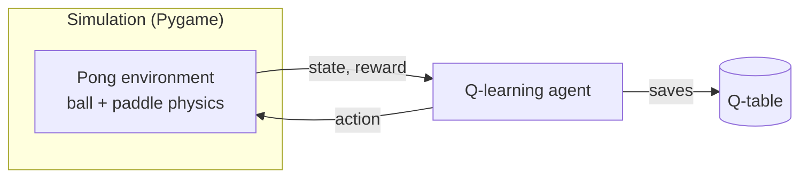
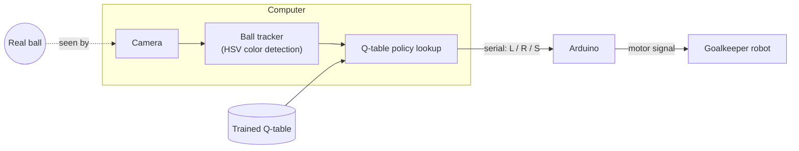

# Goalkeeper-QLearning

A reinforcement learning goalkeeper robot, built as an undergraduate graduation project in Computer Engineering at Palestine Polytechnic University. A tabular Q-learning agent is trained in simulation, then deployed on a physical robot: a camera tracks a real ball, the learned policy decides whether to move left, move right, or stay, and an Arduino drives the motor.

<!-- TODO: add a demo GIF or video link of the physical robot here -->
<!--  -->

## Overview

The project has two phases:

1. **Training in simulation.** The agent learns in a custom single-paddle Pong environment built with Pygame, intercepting a bouncing ball through trial and error.
2. **Deployment on hardware.** The simulated ball is replaced by a real one. A camera detects the ball's position, the trained policy chooses an action, and the action is sent to an Arduino that moves the goalkeeper.

## System Architecture

**Training:**



**Deployment (physical robot):**



### Design decision: Raspberry Pi → Computer + Arduino

The original design ran the whole pipeline on a Raspberry Pi. In practice, the Pi was too slow for real-time control, so the system was split:

- **Computer:** camera processing, ball tracking, and policy inference
- **Arduino:** receives the chosen action and drives the motor

This kept the time-critical perception and decision loop on hardware fast enough to react to the ball, while the Arduino handled low-level actuation.

### Sim-to-real mapping

The simulated field and the physical workspace have different dimensions. Simulation coordinates are scaled proportionally to the robot's physical range of motion, and the camera placement was calibrated so that detected ball positions map onto the same coordinate space the agent was trained in.

## Agent Design

| Component | Setting |
|---|---|
| Algorithm | Tabular Q-learning |
| State | Goalkeeper position and ball position (vertical axis), discretized into a 30 × 30 grid |
| Actions | Move up, move down, stay |
| Reward | +10 for a save, −1 when the ball gets past |
| Episode end | When a save is made |
| Training | 5,000 episodes, learning rate 0.1, ε-greedy exploration with linear decay |

## Project Structure

```
goalkeeper_q_learning/   simulation environment, training, and run modes
ball_detection/          camera-based ball detection and tracking (HSV color)
arduino/goalkeeper/      Arduino sketch that drives the motor from serial commands
```

## Computer–Arduino Communication

In `play` mode, the computer sends each action to the Arduino over USB serial (9600 baud) as one byte (`goalkeeper_q_learning/arduino.py`):

| Q-table action | Byte | Arduino behavior |
|---|---|---|
| 0 | `L` | motor moves left |
| 1 | `S` | motor stops |
| 2 | `R` | motor moves right |

The computer sends a command when the action changes and repeats the current command every 0.2 s. If the Arduino receives nothing for 1 s, it stops the motor, so the robot halts if the computer crashes or the cable is unplugged. When `play` exits, it sends `S`.

The sketch (`arduino/goalkeeper/goalkeeper.ino`) is written for an H-bridge driver such as the L298N: `IN1` on pin 7, `IN2` on pin 8 and `ENA` on PWM pin 9. Change the pin constants and `MOTOR_SPEED` to match your wiring. If the robot moves the wrong way, swap the motor wires or swap `IN1`/`IN2`.

## Getting Started

```bash
pip3 install -r requirements.txt
cd goalkeeper_q_learning
```

Run modes:

```bash
python3 main.py train   # train a new agent in simulation
python3 main.py sim     # watch a trained agent play against the simulated ball
python3 main.py play    # run the trained agent against a real, camera-tracked ball
python3 main.py human   # play manually with the keyboard
```

Before running `play`, upload `arduino/goalkeeper/goalkeeper.ino` to the Arduino with the Arduino IDE and connect it by USB. The serial port is detected automatically; to choose it yourself, use `--port`. To test without the robot, use `--no-arduino`:

```bash
python3 main.py play --port /dev/cu.usbmodem14101   # macOS/Linux; on Windows e.g. --port COM3
python3 main.py play --no-arduino                   # camera + policy only
```

Close the Arduino IDE's Serial Monitor first, because only one program can use the port at a time.

Run any mode with `--help` to see its options (training length, ball/paddle speed, which saved model to use).

## Results

<!-- TODO: add a reward curve from training (plot_args output) and a save rate,
e.g. "The trained agent saved X of 100 simulated shots." -->

## Limitations and Future Directions

- **Reactive, not anticipatory.** The agent observes only the ball's current vertical position, with no velocity or horizontal position, so it reacts rather than predicting where the ball will go.
- **Coarse state representation.** A lookup table over a 30 × 30 grid limits precision and does not scale to richer observations. Function approximation (e.g., DQN) would remove this limit.
- **Lighting-dependent perception.** Color-based detection depends on consistent lighting and a ball color that stands out from the background.
- **Fixed sim-to-real mapping.** The proportional mapping works for one calibrated setup, but the policy has no robustness to conditions it did not see in training. Domain randomization is a natural next step.

## Team and Contributions

<!-- TODO: list team members and your own contributions -->