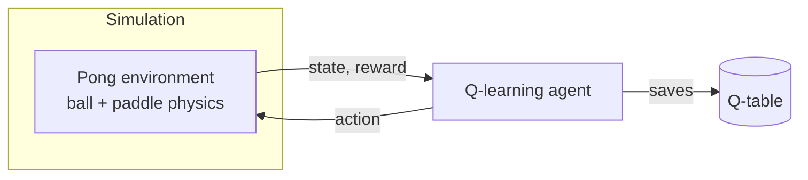
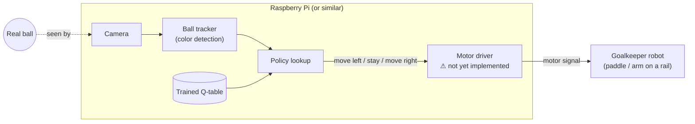

# Goalkeeper-QLearning

A reinforcement learning project that trains a goalkeeper agent with tabular Q-learning, with the goal of controlling a physical goalkeeper robot: a camera watches a real ball and the trained policy decides whether the robot should move left, move right, or stay in place.

## Overview

The project has two phases. First, an agent is trained entirely in a simulated, single-paddle Pong environment, learning through trial and error to intercept a bouncing ball. Second, the trained policy is deployed against a real ball: a camera detects the ball's position, and the same decision-making process that was learned in simulation now controls the robot in real time.

## How It Works

During training, the agent only observes two numbers — its own position and the ball's position — and chooses one of three actions each step: move one way, move the other way, or stay still. It is rewarded for intercepting the ball and penalized for letting it past, and over many episodes it learns a policy (a lookup table of state → best action) that maximizes saves.

At deployment, the simulated ball is replaced by a real one. A camera feed is processed with color-based ball tracking to find the ball's position, which is fed into the same trained policy used during training. The policy's decision then needs to drive a motor to physically move the robot.

**Training-time architecture:**



**Deployment architecture (physical robot):**



The Pi only needs to run inference (load the trained Q-table and look up an action per frame) — training itself happens beforehand on a regular computer.

## Project Structure

```
goalkeeper_q_learning/   simulation, training, and the four run modes (see below)
ball_detection/          camera-based ball tracking (color detection)
```

## Getting Started

```bash
pip3 install -r requirements.txt
cd goalkeeper_q_learning
```

The project runs in four modes:

```bash
python3 main.py train   # train a new agent in simulation
python3 main.py sim     # watch a trained agent play against the simulated ball
python3 main.py play    # drive a trained agent using a real, camera-tracked ball
python3 main.py human   # play manually with the keyboard, to try out the game itself
```

Run any mode with `--help` to see its options (e.g. training length, ball/paddle speed, which saved model to use).

## Agent Design

The agent's state is its own position and the ball's position, discretized into a coarse grid so a simple table (rather than a neural network) can represent the policy. It has three actions (move one way, move the other way, stay), gets a positive reward for a successful save and a small penalty for a miss, and an episode ends the moment a save is made. This is a standard, minimal setup for demonstrating tabular Q-learning on a continuous-feeling control task.

## Current Status & Remaining Work

Implemented: the training simulation, the trained agent, and camera-based ball detection. Not yet implemented: the final step of sending the agent's decision to an actual motor — today, that decision only drives an on-screen visualization. Completing the physical build requires adding motor control on the target hardware (e.g. a Raspberry Pi) and calibrating the mapping between camera coordinates and the robot's physical range of motion.

## Limitations

- Ball detection relies on color, so it depends on consistent lighting and a ball color distinguishable from the background.
- The agent reasons about a single axis of motion only, not the ball's full trajectory.
- The policy is trained on a simplified, simulated ball physics model, so some retraining or tuning should be expected once real hardware is introduced.
