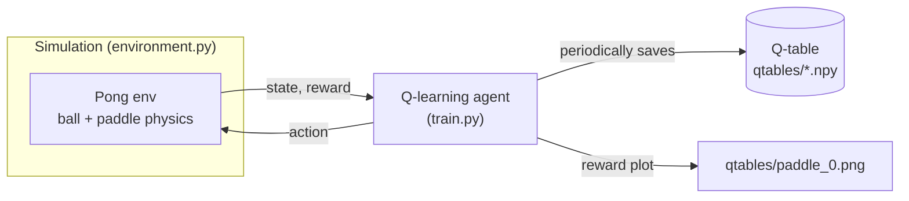
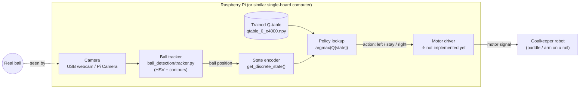

# Goalkeeper-QLearning

A tabular Q-learning agent that learns to play goalkeeper in a simulated, single-paddle Pong environment, then gets deployed to a **physical goalkeeper robot**: a camera watches a real ball, the trained policy decides whether the robot should move one way, the other way, or stay put, and that decision drives a motor.

This repo currently implements the simulation, training, and vision (ball detection) pieces. The motor/actuator side is hardware you attach — see [Hardware integration](#hardware-integration-camera--pi--motor) below for exactly what's missing and where it plugs in.

## How it works

**Training happens entirely in simulation.** `environment.py` implements a one-paddle Pong game (`Ball`, `Paddle`, `Pong`) with the classic RL loop — `reset()` / `step(action)` / `render()`. The agent only ever sees two numbers: the paddle's position and the ball's position (both along the paddle's single axis of motion). It has 3 possible actions — move one way, stay, move the other way — and gets rewarded for intercepting the ball and penalized for letting it past. `train.py` runs standard Q-learning against this simulation and periodically saves the Q-table to `goalkeeper_q_learning/qtables/`.

**Deployment swaps the simulated ball for a real one.** Once a Q-table is trained, `play.py` opens a webcam instead of a simulated ball: each frame, `ball_detection/tracker.py` finds the ball by color (HSV thresholding + contour detection) and reports its position. That position is fed into the same state-discretization the agent was trained with, the frozen Q-table is looked up, and out comes an action — move / stay / move. Right now that action only drives the on-screen simulated paddle (for visualizing that the policy responds correctly to the real ball); wiring it to an actual motor is the last remaining step, described below.

### Training-time architecture



### Deployment-time architecture (the physical robot)



The Pi only ever needs to run *inference*: it loads the small, already-trained Q-table and does a lookup per frame — no training happens on-device.

## Repository layout

```
goalkeeper_q_learning/
  environment.py    # Ball/Paddle/Pong simulation — the RL environment
  helpers.py        # shared constants, q-table load/save, plotting
  train.py          # Q-learning training loop (simulation only)
  sim.py            # replay a trained q-table against the simulated ball
  play.py           # replay a trained q-table against a real, webcam-tracked ball
  human_play.py     # manually control the paddle with the keyboard, for testing the env
  main.py           # CLI entry point — dispatches to the four modes above
  qtables/          # trained Q-tables (.npy) and training reward plots (.png)

ball_detection/
  tracker.py        # shared HSV + contour ball-tracking function used by play.py
  HSV_color.py       # interactive trackbar tool for tuning HSV thresholds to your ball/lighting
  detection.py       # alternative blob-detector approach (experimentation)
  new_detection.py   # standalone CLI wrapper around tracker.py, for testing detection alone
```

## Usage

Install dependencies (use `python3`/`pip3` — most systems, including a stock macOS install, don't alias plain `python`/`pip` to Python 3):

```bash
pip3 install -r requirements.txt
```

All modes are run through `main.py` (from inside `goalkeeper_q_learning/`, or adjust paths accordingly):

```bash
# Train a fresh Q-learning agent against the simulated ball.
# Renders every episode live (so you can watch it improve) and saves
# periodic q-tables + a reward plot to qtables/. Defaults to 5001 episodes.
python3 main.py train

# Train for a specific number of episodes instead of the default.
python3 main.py train --episodes 20000

# Tune ball speed / paddle speed (available on all four modes).
python3 main.py train --ball-speed 20 --paddle-speed 18

# Watch a trained agent play against the simulated ball (no camera needed).
# Useful for sanity-checking a q-table before touching real hardware.
python3 main.py sim --qtable qtable_0_e4000.npy --episodes 20

# Drive the trained agent from a live, webcam-tracked ball.
python3 main.py play --qtable qtable_0_e4000.npy

# Manually control the paddle with W/S, to test the environment itself.
python3 main.py human
```

Each mode also runs standalone (`python3 train.py`, `python3 sim.py`, etc.) if you'd rather bypass the CLI.

`train` renders every episode in real time by default, so you can literally watch the agent get better — but that also means the full run takes noticeably longer in wall-clock time than a headless training loop would. Since a Q-table checkpoint is saved every 100 episodes regardless, it's safe to stop training early with Ctrl+C once it looks good enough, rather than waiting for the full episode count.

Before running `play` for the first time, recalibrate the ball color thresholds for your ball/lighting using `ball_detection/HSV_color.py` (an interactive trackbar tool) and update `ORANGE_MIN` / `ORANGE_MAX` in `ball_detection/tracker.py` accordingly — the shipped defaults are tuned for an orange ball under whatever lighting the original scripts were tested under, and will need retuning for any different color or environment.

## Environment & agent design

- **State**: `(paddle_position, ball_position)`, both along the paddle's single axis of motion. Discretized into a 30×30 grid (`TABLE_SIZE` in `train.py`) to index the Q-table.
- **Actions**: 3 discrete choices — move one way, stay, move the other way (encoded as `0` / `1` / `2`; see `get_human_action()` in `human_play.py` for the mapping used everywhere).
- **Reward**: `+10` for intercepting the ball, `-1` for letting it past, `0` otherwise. `Pong.step()` returns the reward for that single step, not a running total.
- **Episode**: ends the instant the paddle intercepts the ball; missing the ball does *not* end the episode, it just penalizes and play continues — so an episode models "how long until the next save," not "one point."
- **Q-table**: a plain NumPy array of shape `(30, 30, 3)`, small enough to ship as a file and load instantly on constrained hardware like a Raspberry Pi.
- **Hyperparameters** (`q_learning_constants()` in `helpers.py`): `LEARNING_RATE=0.1`, `DISCOUNT=1`, `EPISODES=5001` (overridable via `--episodes`), `SHOW_EVERY=1` (render every episode), `STATS_EVERY=100` (checkpoint + progress-print interval). With these defaults, average episode reward should visibly climb toward the max of 10 within a few hundred episodes as the agent learns to intercept the ball with fewer misses.
- **Speed**: ball speed (`DEFAULT_BALL_SPEED=10`) and paddle speed (`DEFAULT_PADDLE_SPEED=12`) are both overridable via `--ball-speed`/`--paddle-speed` on any of the four modes. Note that a Q-table trained at one speed encodes a policy tuned to that speed's timing, so retrain (or at least re-evaluate with `sim`) after changing speed rather than assuming an old checkpoint still performs well.

## Hardware integration (camera → Pi → motor)

The vision and decision-making pieces are implemented; the actuation piece is not. To finish the physical build:

1. **Compute**: run `play.py` on the Raspberry Pi (or similar SBC). It only needs to do inference — loading `qtables/qtable_0_e4000.npy` and one Q-table lookup per frame — so a Pi is comfortably enough hardware (training should stay on a dev machine, not the Pi).
2. **Camera**: `play.py` currently opens a USB webcam via `cv2.VideoCapture(0)`. If you're using the Raspberry Pi Camera Module instead, swap this for `picamera2` (or an equivalent V4L2-compatible capture path) feeding frames into `track_ball()` unchanged.
3. **Motor driver (missing piece)**: in `play.py`, right after `action = np.argmax(q_table[discrete_state])`, `action` is currently only passed into the simulated `env.step(action)` for on-screen visualization. This is where a real motor call needs to be added — e.g. GPIO/PWM calls to a stepper or DC motor driver — mapping the 3 discrete actions to "move left," "stay," "move right" on the physical rail.
4. **Calibration**: the mapping between the camera's pixel coordinates (from `track_ball()`) and the robot's physical range of travel is rig-specific and needs to be measured and tuned once the robot is built (e.g. clamping/scaling `y_medium` in `play.py` to match how far the physical arm can actually move).

## Known limitations

- Ball tracking assumes a single, solid, distinctly-colored ball (tuned for orange by default) against a background that doesn't contain that color — it will get confused by clutter or lighting changes without retuning.
- The agent only reasons about one axis of motion; it has no notion of the ball's depth or the other axis, so it can't anticipate a diagonal approach beyond what that single axis captures.
- The Q-table is trained purely in simulation; the simulated ball's physics (bounce randomness, speed) are a rough approximation of a real ball, so expect to retrain or fine-tune based on how the real ball actually behaves once hardware is in the loop.
